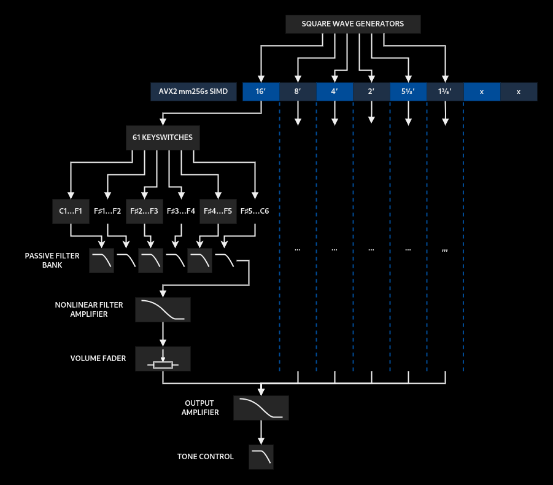

# Table of Contents <!-- omit from toc -->
- [Description](#description)
  - [Technical details](#technical-details)
    - [Architecture](#architecture)
    - [Oscillators](#oscillators)
    - [Articulation](#articulation)
    - [Tone](#tone)
    - [Bleeds and noise floor](#bleeds-and-noise-floor)
- [Building from source](#building-from-source)
  - [Linux](#linux)
  - [Windows](#windows)

# Description

**FORMA** is a digital emulation of the **Formation 1** transistor combo organ manufactured in the GDR during the 1980s. This virtual instrument imitates the original's signal flow, timbre, articulation, nonlinearities, signal bleeds and noise floor.


The plug-in currently supports VST3 and CLAP formats for Windows and Linux hosts. 
Only x86 processors with AVX2 instruction set are supported.
Intel CPUs released after 2013 (Celeron/Pentium models after 2020) and AMD CPUs released after 2015 are good to go.

MacOS and ARM support is not a high priority at the moment, but may be considered in the future.

## Technical details

### Architecture
Original organ uses a divide-down architecture to generate all the tones accros the keyboard. Master oscillator (2.12068 Mhz Colpitts oscillator) feeds into chromatic scale frequency generator ICs (MM5555 and MM5556-like) to generate the 12 notes of the top octave, which are then divided by binary counters to generate the rest of notes. At this stage all the signals are square waves.

Then, tones are distributed across the keyboard: under the each of 61 keys there's 6 *needle contacts* corresponding to 6 ranks of the organ: 16′, 8′, 5⅓′, 4′, 2′, 1⅗′. Pressing a key shorts the needles underneath it to its corresponding bus, and tones pass to the filtering stage.

For each rank, the keyboard has six output points. Each output is the sum of signals across several keys: 6 keys, 12 keys, 12, 12, 12, 6. Those 6 output points are routed to 6 input points of this rank's filter, which turns the square waves into something more sine-like.  Filtered signal then goes through the rank's volume fader. Fader'ed ranks are then summed and go into the output.

This signal flow and its nuances are preserved in the software imitation.

### Oscillators

Virtual oscillators are antialiased without the need for oversampling. 
In 4 lower octaves square waves are generated using an original algorithm, in which Sinc integral is approximated with trigonometric functions. The result is semi-bandlimited, and aliasing is negligible for oscillators in lower octaves. Upper oscillators are computed with an optimized additive algorithm using Chebyshev polynomials of the first kind. These oscillators are fully bandlimited.

Tuning table for oscillators contains the ±0.5¢ error that's present in the original MM5555/MM5556 chromatic frequency generator ICs.

### Articulation

Keyboard action of the original organ has a particular behaviour that directly affects the sound. The thing is, 6 needle contacts (which correspond to 6 ranks) under each key are never shorted simultaneously. They are just pieces of wire that touch the tone bus whenever key is pressed, and since they aren’t mechanically calibrated, each one closes at a slightly different time. The slower key is depressed, the more uneven attack becomes. This behaviour is reproduced in software, and is velocity-sensitive.

### Tone
/todo

### Bleeds and noise floor
This plugin imitates several kinds of bleeds and noises that original organ produces:

  * Background noise and 50 hz hum and its harmonics (-40 dB)
  * Unfiltered square tones that leak into the output past the keyswitches (-70 dB)
  * Leakage of ranks with faders turned down (around -50 dB) 
  * Significant leakage of the 1⅗′ rank into the output (up to -30 dB)

# Building from source

Tested on Linux Mint and Windows 10 with VSCode.

```
git clone https://github.com/ath-r/forma.git
git submodule update --init --recursive
```

## Linux
```
sudo apt update
sudo apt install build-essential gdb
sudo apt install pkg-config
sudo apt install clang-tools-14 lld-14 llvm-dev
```
Then configure cmake and compile with Clang. Use Clangd for code completion.

## Windows

On Windows, you will need to use [Visual Studio Build Tools](https://visualstudio.microsoft.com/downloads/#build-tools-for-visual-studio-2022) to get MSVC and Windows SDK (installed with "Desktop Development with C++") **and also** MSBuild support for LLVM (clang-cl) toolset **and** C++ Clang Compiler for Windows (can be installed from "Individual Components").


 Then compile with Clang (MSVC CLI) amd64. Use Intellisense for code completion.